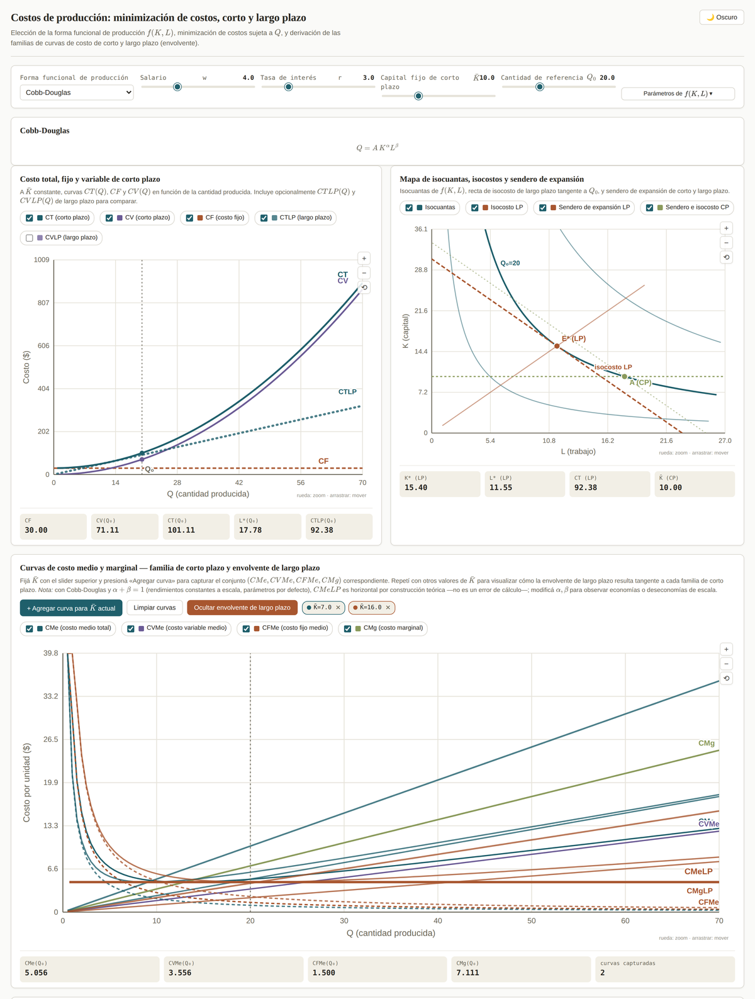

# Simulador de costos de producción — corto y largo plazo

Simulador interactivo para la enseñanza de la teoría de la producción y los costos en cursos de Microeconomía Intermedia. Permite explorar, a partir de distintas especificaciones de la función de producción $f(K,L)$, la minimización de costos sujeta a un nivel de producción $Q$ y la derivación de las familias de curvas de costo de corto y de largo plazo, incluyendo la propiedad de envolvente.

**[▶ Abrir el simulador](https://fcontiggiani.github.io/costos-cp-lp/costos_produccion.html)**

---

## Contenido pedagógico

El simulador cubre el bloque temático de teoría de la producción y costos:

- Funciones de producción, isocuantas y demandas condicionales de factores.
- Minimización de costos sujeta a una restricción de producción, planteada explícitamente como problema de Lagrange.
- Distinción formal entre el problema de largo plazo (K y L como variables de elección libres) y el de corto plazo (K fijo en $\bar K$, problema reducido a una variable).
- Costo total, fijo y variable de corto plazo; costo medio y marginal.
- Propiedad de envolvente: la curva de costo medio de largo plazo como envolvente de la familia de curvas de costo medio de corto plazo, cada una asociada a un nivel distinto de capital fijo.

## Formas funcionales incluidas

| Forma | Especificación | Particularidad pedagógica |
|---|---|---|
| Cobb-Douglas | $Q = A\,K^{\alpha}L^{\beta}$ | Rendimientos a escala ajustables vía $\alpha+\beta$; caso base con solución interior y tangencia clásica. |
| Leontief (complementos perfectos) | $Q = \min\{K/a,\ L/b\}$ | Sin sustitución entre factores; el lagrangiano estándar no aplica en el vértice (no diferenciable) y se resuelve por inspección directa. |
| Sustitutos perfectos | $Q = aK + bL$ | Solución de esquina: la firma emplea exclusivamente el factor más barato por unidad de producto. |
| CES | $Q = A\left[\alpha K^{\rho} + (1-\alpha)L^{\rho}\right]^{1/\rho}$ | Elasticidad de sustitución constante $\sigma=1/(1-\rho)$; converge a Cobb-Douglas ($\rho\to0$), sustitutos perfectos ($\rho=1$) o Leontief ($\rho\to-\infty$) según el parámetro. |
| Cúbica | $Q = A\,K^{\alpha}\left(aL+bL^2-cL^3\right)$ | Reproduce la forma canónica de libro de texto: producto marginal primero creciente y luego decreciente, generando la curva de costo marginal con forma de U y el punto de inflexión asociado. |

## Paneles del simulador

1. **Costo total, fijo y variable de corto plazo** — curvas $CT(Q)$, $CF$ y $CV(Q)$ a $\bar K$ constante.
2. **Mapa de isocuantas, isocosto y senderos de expansión** — isocuantas de $f(K,L)$ para tres niveles de producción, recta de isocosto de largo plazo tangente al óptimo, sendero de expansión de largo plazo y punto de corto plazo a $\bar K$ fijo. K en el eje de ordenadas, L en el eje de abscisas.
3. **Familia de curvas medias y marginales con envolvente de largo plazo** — permite fijar $\bar K$, capturar el conjunto $(CMe, CVMe, CFMe, CMg)$ correspondiente, repetir con otros valores de $\bar K$ y activar la envolvente $CMeLP$/$CMgLP$ tangente a cada familia de corto plazo. Cada curva es tildable de forma independiente.

Cada forma funcional incluye además una derivación analítica colapsable con el planteo lagrangiano completo, sus condiciones de primer orden y la reducción explícita al problema de corto plazo.

## Controles disponibles

| Control | Descripción |
|---|---|
| Forma funcional de producción | Selector entre las cinco especificaciones descriptas arriba. |
| $w$ (salario) | Precio del factor trabajo. |
| $r$ (tasa de interés) | Precio del factor capital. |
| $\bar K$ (capital fijo de corto plazo) | Nivel de capital congelado para los paneles de corto plazo. |
| $Q_0$ (cantidad de referencia) | Nivel de producción de referencia marcado en los tres paneles. |
| Parámetros de $f(K,L)$ | Coeficientes propios de la forma funcional seleccionada (p. ej. $\alpha,\beta$ en Cobb-Douglas, $\rho$ en CES). |

## Requisitos técnicos

Archivo HTML autocontenido: no requiere instalación, compilación ni conexión a un servidor propio. Dependencias externas únicas:

- [MathJax 3](https://www.mathjax.org/) (`tex-svg.min.js`, vía CDN de cdnjs) para el renderizado de las ecuaciones.

El resto de las visualizaciones (gráficas, mapas de isocuantas, curvas de costo) se generan con SVG nativo — no se emplean librerías de gráficos externas (se evaluó y descartó el uso de Plotly y Three.js por problemas de fiabilidad en la carga vía CDN en entornos de aula).

Compatible con navegadores modernos con JavaScript habilitado. Incluye alternancia de tema claro/oscuro con persistencia en `localStorage` (con manejo de excepciones para entornos de iframe con almacenamiento restringido, como algunas configuraciones institucionales de Moodle).

## Licencia

Material de uso educativo. Libre de adaptar y redistribuir citando la fuente.
